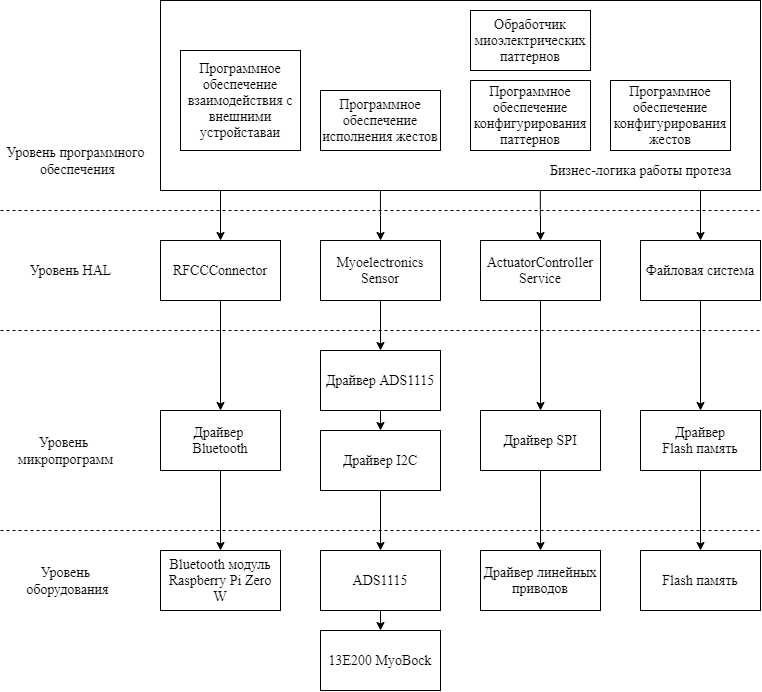
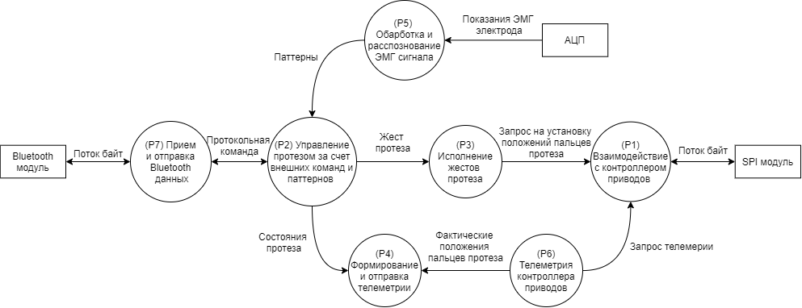

# Контроллер управления протезом руки человека

## Description

Проект содержит программное обеспечение для Raspberry Pi Zero W, реализующие логику бионического протеза руки человека.
Краткое описание функциональных возможностей:
- Исполнение жестов протеза
- Взаимодействие с внешними системами по Bluetooth (передача данных в protobuf структурах через [самописный протокол](https://github.com/paulrozhkin/handcontrol-documentation/blob/master/bluetooth_api.md))
- Обработка показаний миоэлектрических датчиков и выделение паттернов жестов. Количество распознаваемых паттернов 2.
- Передача управляющих команд для установки положения линейных двигателей по интерфейсу SPI на [контроллер линейных приводов](https://github.com/paulrozhkin/handcontrol-motor-controller)

## Linked Repositories
- [Документация](https://github.com/paulrozhkin/handcontrol-documentation)
- [Контроллер управления линейными приводами на STM32F103C8T6](https://github.com/paulrozhkin/handcontrol-motor-controller)
- [Приложение для конфигурирования протеза для ПК на WPF](https://github.com/paulrozhkin/HandControlApplication)
- [Приложение для управления протезом для Android](https://github.com/ForsaiR/HandControlAndroidAplication)
- [Схемотехника драйвера моторов (Altium Designer)](https://github.com/paulrozhkin/DCDriverShematic)
- [Схемотехника контроллера управления (Altium Designer)](https://github.com/paulrozhkin/ArmProsthesisShematic)
- [Сервер для одновременной работы с несколькими протезами по MQTT на Kotlin](https://github.com/paulrozhkin/hand-control-mqtt)
- [MQTT proxy для контроллера управления протеза для STM32F767ZITX](https://github.com/paulrozhkin/handcontrol-mqtt-proxy)

---

## Architecture

Программное обеспечение контроллера представлено в виде уровневой архитектуры. За счет того, что в проекте используется Raspberry Pi Zero W с операционной системой Raspberry Pi Os, то в разработке уровеня драйверов и оборудования нет необходимости. Исключением является внешнее АЦП для которого используется пакет Adafruit_ADS1x15. На уровне HAL имеются различные сервисы для более удобной и абстрактной работы с оборудования, там происходит преобразование данных из бинарного формата в доменные объекты.

Уровень программного обеспечения представлен в виде сети процессов Кана. Каждая функция протеза является отдельным потоком, взаимодействие с которым происходит с помощью очередей Python Queue. Так, имеются потоки для исполнения жестов, обработки команд, телеметрии. Наиболее интересным потоком является поток распознавания миоэлектрических паттернов P5.

Распознавание миоэлектрических паттернов осуществляется следующим образом: происходит считывания ЭМГ показаний с частотой 100-130Гц с одноканального электрода. В потоке ЭМГ данный происходит выделение сигнала паттерна за счет расчета среднего по окну из 5 элементов с пороговым значением 400. Над полученным сигналом проводится сегментирования на 10 сегментов и пока каждому сегменту происходит извлечение MAV (mean absolute value) признаков. Полученные признаки передаются в обученную KNN сеть с 10 входами и 2 выходами. KNN сеть обучена для двух паттернов: медленного и резкого сгибания мышц руки. В результате точность для двух паттернов достигает свыше 95%, а среднее время распознавания – 16мс, что позволяет использовать алгоритм в реальном времени.

---

## License

- **[MIT license](http://opensource.org/licenses/mit-license.php)**
- Copyright 2020 © <a href="https://github.com/paulrozhkin" target="_blank">Paul Rozhkin</a>.
